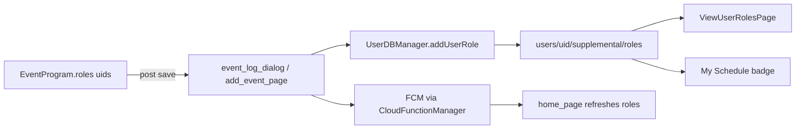

# Users / Belfast Volunteers — improvement plan

> **Purpose:** Living document for a multi-session refactor of the `User` model, schedule sync, and Belfast Volunteers UI.  
> **Created:** 2026-07-04  
> **Status:** Phase 5 complete — deploy `firestore.rules` for `user_tags` collection  
> **Start here in a new chat:** “Continue the Users/Volunteers improvement from `docs/users-volunteers-improvement.md`”

---

## Goals

1. Improve the **Users data model** (typed supplemental data, fewer foot-guns).
2. Improve the **Belfast Volunteers** section (not just the list page — profile, schedule, location).
3. Preserve existing behaviour: program role assignment → user schedule → push notifications → My Schedule.

---

## Current architecture

### Two Firestore identities

| Collection | Purpose | Key link |
|------------|---------|----------|
| `users/{uid}` | Volunteer **profile** (name, location, photo, flags) | `AuthID` field |
| `everyone/{authID}` | Auth identity: email, FCM tokens, bookmarks | Doc ID = Firebase Auth UID |

Registration creates both (`RegisterUserPage` → `UserDBManager.addUser` + `EveryoneDBManager.createUser`).

### Core profile (`users/{uid}`)

| Field | Type | Purpose |
|-------|------|---------|
| `Forename` | String | First name (Dart getter is `forname` — historical typo) |
| `Surname` | String | Last name |
| `Location` | String | `Belfast`, `Portadown`, `North Coast` |
| `ImgSrc` | String | Profile photo URL (often Google Drive) |
| `AuthID` | String | Links to `everyone/{authID}` |
| `IsAreaAdmin` | bool | Admin UI, info editing, register/edit users |
| `IsLeader` | bool | Create/edit events |

### Supplemental subcollection (`users/{uid}/supplemental/`)

Not part of `User.toJson()` — loaded on demand via `UserDBManager`.

#### `roles` doc — personal schedule (denormalized from event program)

```json
{
  "roles": [
    {
      "postID": "<event post id>",
      "id": 1234567890123,
      "startMil": 1710000000000,
      "endMil": 1710003600000,
      "title": "Setup"
    }
  ]
}
```

- `id` matches `EventProgram.roles[].id` (millisecondsSinceEpoch at creation).
- Written when program roles are assigned; removed on role/post cleanup.

#### `posts` doc — authorship / contributorship index

```json
{
  "posts": [
    { "id": "<post id>", "ownership": "author" },
    { "id": "<post id>", "ownership": "contributor" }
  ]
}
```

### In-memory only on `User`

```dart
List<Map<String, dynamic>>? _roles, _posts;
```

Set via `setRoles` / `setPosts`; exposed as unmodifiable lists. **Not typed.**

### Schedule data flow



**Dual source of truth:** assignments live in `EventProgram.roles[].uids` *and* denormalized on each user's `roles` doc. **Phase 4:** `sync_user_roles_on_program_write` (Cloud Function) re-syncs user supplemental roles whenever `events/{postId}/supplemental/program` is written. Client no longer writes roles on post save; stale-row cleanup remains client-side via `UserScheduleService`.

---

## Feature map — where User is used

### Schedule / program roles

| Action | File(s) |
|--------|---------|
| Assign role on new post | `lib/pages/events/add_event_page.dart` |
| Assign/remove on post save | `lib/widgets/posts/event_log_dialog.dart` |
| Program role UI | `lib/pages/events/add_program_role_page.dart`, `edit_program_role_page.dart` |
| View own schedule | `lib/pages/personal_home.dart` → `view_user_roles_page.dart` |
| View another user's schedule | `view_all_users_page.dart`, `user_selector_dialog.dart` (`allowTaskCheck`) |
| Program tile → profile | `lib/widgets/posts/program_tile.dart` → `DialogManager.showUserProfile` |
| Role refresh on notification | `lib/pages/home_page.dart` `_updateUserRoles` |
| Login cleanup (past roles) | `lib/main.dart` |
| Schedule cleanup on page open | `lib/pages/personal/view_user_roles_page.dart` |

### Post involvement (author / contributor)

| Action | File(s) |
|--------|---------|
| Write on create/edit | `add_event_page.dart`, `event_log_dialog.dart` |
| View My Posts | `lib/pages/personal/view_my_posts_page.dart` |
| Cleanup stale entries | `view_my_posts_page.dart` `_removeOldPosts` |

### Belfast Volunteers directory

| Action | File(s) |
|--------|---------|
| List + search | `lib/pages/personal/view_all_users_page.dart` |
| Register (admin) | `lib/pages/personal/register_user_page.dart` |
| Edit (admin, long-press) | `lib/pages/personal/edit_user_page.dart` |
| Entry from Personal home | `lib/pages/personal_home.dart` |

**Gap:** Page title is "Belfast Volunteers" but lists **all** locations. Comment in `view_all_users_page.dart` acknowledges future location filtering.

### Auth & session

| Action | File(s) |
|--------|---------|
| Guest user | `AppContext` — `User(id: '0', forname: 'Guest', surname: 'Account')` |
| Login lookup | `user_db_manager.fetchUserByAuthID`, `login_page.dart`, `welcome_page.dart` |
| Startup user list | `main.dart` `_fetchAllUsers` (Hive cache, 21-day TTL) |

### Display & caching

| Action | File(s) |
|--------|---------|
| Avatar + Hive cache | `lib/widgets/user_avatar.dart`, `LocalDataManager` |
| Profile dialog | `lib/utility/dialog_manager.dart` |
| Bulk image cache | `home_page.dart` `_performUserImageCache` |
| User picker | `lib/widgets/user_selector_dialog.dart` |

### Permissions summary

| Flag | Effect |
|------|--------|
| `isLeader` | Create events (home FAB) |
| `isAreaAdmin` | Register/edit users, admin section, edit info pages |

---

## Key files (quick reference)

| Area | Path |
|------|------|
| Model | `lib/models/user.dart` |
| DB manager | `lib/firebase/db_managers/user_db_manager.dart` |
| Schedule sync / cleanup | `lib/utility/user_schedule_service.dart` |
| Volunteer locations | `lib/utility/volunteer_locations.dart` |
| Profile hub | `lib/pages/personal/view_user_profile_page.dart` |
| Auth / tokens / email | `lib/firebase/db_managers/everyone_db_manager.dart` |
| App-wide user state | `lib/utility/app_context.dart` |
| Volunteers list | `lib/pages/personal/view_all_users_page.dart` |
| Schedule view | `lib/pages/personal/view_user_roles_page.dart` |
| My Posts | `lib/pages/personal/view_my_posts_page.dart` |
| Register / Edit | `register_user_page.dart`, `edit_user_page.dart` |
| Program model | `lib/models/event/event_program.dart` |
| Role refresh prefs | `lib/utility/app_shared_preferences.dart` (`canRefreshRoles` — 2 min throttle) |
| Tests | `test/unit/models/user_test.dart` |

---

## Known issues & technical debt

| Issue | Severity | Notes |
|-------|----------|-------|
| Untyped `Map<String, dynamic>` for roles/posts | Medium | Typos break silently; no `fromMap`/`toJson` on sub-models |
| Dual source of truth (program vs user roles) | High | Drift if client write fails |
| Cleanup logic duplicated | Medium | `main.dart`, `ViewUserRolesPage`, `ViewMyPostsPage` |
| `allowPostView` unused | Low | Passed to `ViewUserRolesPage` but never read |
| Missing `await` on DB writes | High | `addPostToUser`, supplemental init in `addUser`, `_removePostsFromUser` |
| Location ignored in Volunteers list | Medium | Register supports 3 locations; list does not filter |
| My Schedule badge | Low | Counts role **entries**, not distinct upcoming posts |
| `forname` typo | Low | Wide rename; entrenched in Firestore keys and Dart API |
| Email not on User | Medium | Only in `everyone`; Edit User shows linked email + Link/Reassign |
| Placeholder / temp Auth | Low | Prefer empty `AuthID` placeholders; reassign when they register |
| No user tags / teams | Medium | **Planned Phase 5** — only `isLeader` / `isAreaAdmin` / `location` today |
| No tests for supplemental models | Low | Covered in Phase 1 |
| Role refresh throttled 2 min | Low | Pull-to-refresh may no-op with “Fake Refreshing” |

### Async bugs to fix first (minimal diff)

```dart
// user_db_manager.dart — addUser: await supplemental doc creation
// user_db_manager.dart — addPostToUser: add await before update
// view_user_roles_page.dart — _removePostsFromUser: await removeUserPostRole in loop
```

---

## Recommendations (prioritized)

### Tier 1 — High value, reasonable effort

1. **Typed supplemental models**
   - `UserRoleAssignment` — `postID`, `roleID`, `start`, `end`, `title`
   - `UserPostInvolvement` — `postID`, `PostOwnership` enum (`author`, `contributor`)
   - `fromMap` / `toJson` on each; update `UserDBManager` and callers

2. **Centralize schedule sync**
   - New helper e.g. `lib/utility/user_schedule_service.dart` (or methods on `AppContext`):
     - Add/remove roles when program changes
     - Prune stale roles (single implementation)
     - Refresh current user's roles
   - Remove duplicated cleanup from `main.dart` and pages

3. **Location-aware Volunteers**
   - Filter `allUsers` by location (default Belfast; tabs or dropdown)
   - Or rename section to "Volunteers" if showing all
   - Show location chip on list tiles

4. **Fix async bugs** (see table above)

### Tier 2 — UX improvements

5. **Profile hub** — replace tap → schedule-only with:
   - Photo, name, location, Leader/Admin badges
   - Next 3 upcoming tasks + link to full schedule
   - Optional admin-only contact info

6. **Better schedule view**
   - Upcoming vs past (past collapsible)
   - Surface scheduling conflicts in user picker (extend `allowTaskCheck`)
   - Badge: count distinct upcoming **posts**, not raw role rows

7. **`allowPostView`** — implement (show posts they contribute to, admin/leader only) or delete the dead parameter

### Tier 3 — Larger architectural changes

8. **Server-side role sync (Cloud Function)**
   - On program save, CF updates `users/.../roles` from `EventProgram.roles`
   - Reduces client drift and missed awaits
   - Keeps existing read path (`ViewUserRolesPage`)

9. **Extended volunteer profile fields** (Phase 6)
   - `availabilityNotes`, `isActive`, optional admin-only `phone`

10. **Admin-managed user tags** (Phase 5 — see dedicated section)
    - Worship, Technical, Speaker, Usher, etc.; admin CRUD; multi-tag per user; filter list + picker

---

## Suggested implementation phases

Use this checklist across chats. Update **Status** at the top when a phase completes.

### Phase 0 — Quick fixes (1 chat)

- [x] Add missing `await`s in `UserDBManager` and `ViewUserRolesPage`
- [x] Add missing `await`s in `add_event_page`, `event_log_dialog`, `view_my_posts_page` (callers)
- [x] Implement `allowPostView` — Schedule | Posts tabs on `ViewUserRolesPage`
- [x] N/A — unit tests for typed models (Phase 1)

### Phase 1 — Typed models (1–2 chats)

- [x] Create `lib/models/user_role_assignment.dart`
- [x] Create `lib/models/user_post_involvement.dart` (includes `PostOwnership` enum)
- [x] Refactor `User` to use typed lists (Firestore shape unchanged via `toJson`/`fromMap`)
- [x] Update `UserDBManager` read/write
- [x] Update callers: `view_user_roles_page`, `view_my_posts_page`, `main.dart`
- [x] Update `user_test.dart` + new model tests
- [x] Run `flutter analyze` + `flutter test test/unit/`

### Phase 2 — Centralized sync (1 chat)

- [x] Extract `lib/utility/user_schedule_service.dart`
- [x] Single `staleRolePostIDs` / `pruneStaleRoles` used from login + schedule page
- [x] Single `stalePostInvolvementIDs` / `pruneStalePostInvolvements` for My Posts + schedule Posts tab
- [x] Delete duplicated cleanup in `main.dart` / pages
- [x] Unit tests in `test/unit/utility/user_schedule_service_test.dart`

### Phase 3 — Volunteers UI (1–2 chats)

- [x] Location filter on `ViewAllUsersPage` (`VolunteerLocations`, FilterChips: All / Belfast / Portadown / North Coast)
- [x] New `ViewUserProfilePage` (avatar, badges, upcoming task preview, links to schedule/posts)
- [x] Wire list tap → profile hub; full schedule via `ViewUserRolesPage`
- [x] Fix My Schedule badge — `UserScheduleService.upcomingPostCount` (distinct upcoming posts)
- [x] Localize new strings in `app_en.arb` (volunteers, profile, schedule menu)

### Phase 4 — Backend role sync

- [x] Callable CF `sync_user_roles_for_post` — **deploy this first** (same as other HTTPS functions)
- [x] Client invokes CF after program save (`add_event_page`, `event_log_dialog`)
- [x] Optional Firestore trigger `sync_user_roles_on_program_write` (may fail first deploy — Eventarc IAM)
- [x] **Deploy callable:** `firebase deploy --only functions:sync_user_roles_for_post --project ctrim-8b49b`
- [ ] **Optional later:** `firebase deploy --only functions:sync_user_roles_on_program_write` (retry after ~10 min if Eventarc error)

#### Eventarc deploy error (Firestore trigger)

If you see `Permission denied while using the Eventarc Service Agent`:

1. **Use the callable** — the app already calls `sync_user_roles_for_post` after every program save; roles work without the trigger.
2. Wait 5–10 minutes and retry the Firestore trigger deploy (first 2nd-gen function in a project).
3. Or in [Google Cloud Console → IAM](https://console.cloud.google.com/iam-admin/iam?project=ctrim-8b49b), ensure the **Eventarc Service Agent** (`service-<PROJECT_NUMBER>@gcp-sa-eventarc.iam.gserviceaccount.com`) has the **Eventarc Service Agent** role.

### Phase 5 — Admin-managed user tags (1–2 chats)

- [x] **Data model** — `UserTag` (`id`, `name`, optional `color`, `displayOrder`, `isActive`)
- [x] **Firestore** — `user_tags/{tagId}` collection; `Tags: [tagId, …]` on `users/{uid}` (multi-tag per user)
- [x] **DB manager** — `UserTagDBManager` (CRUD; area-admin writes only)
- [x] **Admin UI** — `ManageUserTagsPage`: create, rename, reorder, deactivate tags (Personal admin section)
- [x] **Assign tags** — multi-select on `EditUserPage` / `RegisterUserPage`
- [x] **Display** — chips on profile hub, volunteer list tiles, `DialogManager.showUserProfile`
- [x] **Filter** — `ViewAllUsersPage` and `UserSelectorDialog` filter by one or more tags
- [x] **Cache** — load tags at startup in `AppContext` (same pattern as `allUsers`)
- [x] **Security** — `firestore.rules`: tag definition writes restricted to area admins
- [x] **Seed** — optional initial tags (Worship Team, Technical, Speaker, Usher) via “Add starter tags” on manage page
- [x] **Tests** — `user_tag_test.dart`, tag assignment on `User` model
- [ ] **Deploy rules:** `firebase deploy --only firestore:rules --project ctrim-8b49b`

See [Admin-managed user tags](#admin-managed-user-tags) below for full design notes.

### Phase 6 — Profile enrichment (future)

- [ ] `availabilityNotes`, `isActive` (hide inactive from picker), optional admin-only `phone`
- [x] **Auth link / placeholders** — Register User can save with empty `AuthID`; Edit User Link / Reassign / Unlink via `lib/utility/user_auth_link.dart` (does not delete temp Firebase Auth accounts)
- [ ] Unify or document `users` vs `everyone` email visibility

---

## Admin-managed user tags

> **Status:** Implemented (Phase 5) — admin CRUD in Personal → Admin Tools → Volunteer Tags

### Why admin-managed (not a hardcoded enum)

A fixed enum in Dart would require an app release for every new team name. Area admins creating tags in-app matches how you already manage volunteers and info content — flexible and combinable (one person can be Worship + Technical).

### Proposed data shape

**Tag definitions** — `user_tags/{tagId}`

```json
{
  "Name": "Worship Team",
  "DisplayOrder": 1,
  "Color": "#6B4EAA",
  "IsActive": true
}
```

**User assignment** — on existing `users/{uid}` document (simple queries) or `supplemental/tags` if you prefer not to touch main user docs:

```json
{
  "Tags": ["tagId1", "tagId2"]
}
```

Users hold **tag IDs**, not names — renames propagate everywhere without rewriting user docs.

### Where tags would appear

| Surface | Behaviour |
|---------|-----------|
| **Manage tags** (admin) | CRUD + reorder; deactivate instead of delete if users still assigned |
| **Edit / Register user** | Multi-select chip picker |
| **Belfast Volunteers list** | Filter chips + tag badges on tiles |
| **Profile hub** (Phase 3) | Tag chips under name |
| **User selector** (program roles) | Optional filter: “Worship only”, “Technical only”, etc. |
| **Program tiles** | Optional: show tags under assignee name |

### Implementation sketch

```
lib/models/user_tag.dart
lib/firebase/db_managers/user_tag_db_manager.dart
lib/pages/personal/manage_user_tags_page.dart   # admin
lib/widgets/user_tag_chip.dart                  # display
lib/widgets/user_tag_filter_bar.dart            # list + picker filters
```

Extend `User` with `List<String> tagIDs` (or typed `List<UserTagAssignment>` if you want symmetry with roles). Load `allTags` into `AppContext` alongside `allUsers`.

### Considerations

| Topic | Recommendation |
|-------|----------------|
| **Delete vs deactivate** | Deactivate tags that are still assigned; hard-delete only when zero users |
| **Default tags** | Seed Worship / Technical / Speaker / Usher on first admin visit or via Firebase console — avoid shipping hardcoded lists in code |
| **Leaders vs admins** | Tag **definition** CRUD: area admin only. Tag **assignment** on users: area admin (maybe leaders later) |
| **ctrim_worship overlap** | Worship app has its own user model — tags stay in **ctrim_app** volunteer directory unless you later sync |
| **Scope vs Phase 3** | Do profile hub (Phase 3) first, then tags (Phase 5) — tags display nicely on the hub |

### Effort estimate

~1–2 chats for a solid v1: model + Firestore + admin manage page + edit user assignment + list filter. Picker filter and profile chips add polish in the same phase or immediately after.

---

## Constraints (project rules)

- No `cloud_firestore` in pages/widgets — only `firebase/` and `models/`
- No business logic in widget `build` methods
- Localize user-visible strings
- Do not bump `pubspec.yaml` version numbers
- DB access only via `UserDBManager` / `EveryoneDBManager`
- After significant completion: one-line entry in `AGENTS.md` → Recent changes

---

## Session log

| Date | Chat / work | Done |
|------|-------------|------|
| 2026-07-04 | Initial audit & this document | Findings + phased plan |
| 2026-07-04 | Phase 0 | Async awaits in UserDBManager + callers; `allowPostView` → Schedule/Posts tabs; orphan role cleanup deferred to post-frame |
| 2026-07-04 | Phase 1 | Typed `UserRoleAssignment`, `UserPostInvolvement` + `PostOwnership`; `User`/`UserDBManager`/callers migrated; 3 test files |
| 2026-07-04 | Phase 2 | `UserScheduleService` centralises role/post pruning; callers in `main.dart`, schedule + posts pages |
| 2026-07-04 | Phase 4 | CF `sync_user_roles_on_program_write`; client role writes removed on post save |
| 2026-07-04 | Phase 3 | `ViewUserProfilePage`, location filter on volunteers list, badge fix, l10n |
| 2026-07-04 | Phase 5 | Admin-managed user tags: `UserTag`, `UserTagDBManager`, manage page, assignment, filters, chips |
| 2026-07-26 | Follow-up | Admin-managed locations: `UserLocation`, `UserLocationDBManager`, `ManageUserLocationsPage` (area admin); filters/register/edit use catalog |
| 2026-07-04 | Planning | Admin-managed user tags (Phase 5) — design added; not implemented |

*(Append rows as work progresses.)*

---

## Related docs

- `AGENTS.md` — agent conventions, Dart MCP, recent changes
- `.cursor/skills/ctrim-app-new-feature/SKILL.md` — feature checklist for new models/pages
- `.cursor/rules/ctrim-app-models.mdc` — model conventions (`fromMap`, `toJson`, unmodifiable lists)
